<h3><code>nominjin@github ~ $ ./contributions.sh</code></h3>

 
 
<h3><code>nominjin@github ~ $ whoami</code></h3>
<table>
<td valign="top"></td>
</table>
 
 

 

<h3><code>nominjin@github ~ $ ./links.sh</code></h3>

<b>Information Technology · Agentic Tools Developer · Cyber Security</b>

 
---
 
<h3><code>Favorite Tech</code></h3>

  &nbsp;
  &nbsp;
  &nbsp;
   &nbsp;
  &nbsp;
  &nbsp;
  

---
 
<h3><code>Github Streak</code></h3>

  

 
<h3><code>Top languages</code></h3>

  
  

 
 

---

  

